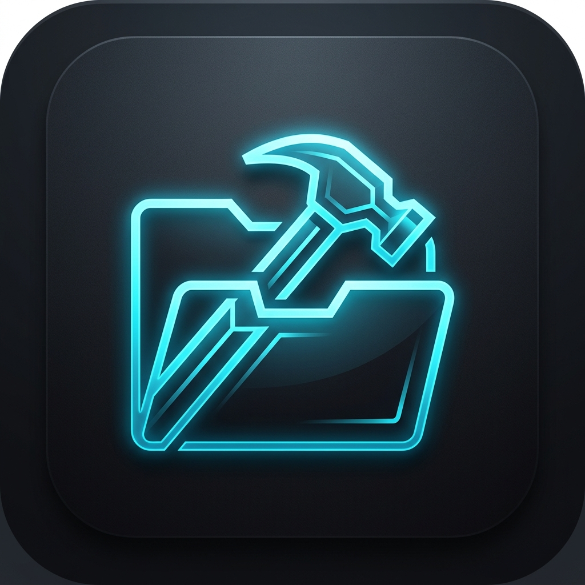

<div align="center">


# 🛠️ FileForge
### High-Performance Intelligent File Organization & Storage Cleanup Suite

[](https://www.microsoft.com/windows)
[](https://www.python.org/)
[](LICENSE)
[](README.md)
[](README.md)

<p align="center">
  <b>FileForge</b> is a minimalistic, high-performance, offline-first desktop application designed to traverse massive directories in seconds, resolve duplicate files, clean developer build leftovers, and visualize storage layouts dynamically.
</p>

---

[📥 Download Installer](#-installation-guidelines) • [⚙️ Key Features](#-key-features) • [📊 Treemap Navigation](#-interactive-squarified-treemap) • [🧪 Testing Suite](#-automated-testing)

</div>

---

## ⚙️ Key Features

### ⚡ Crawling & Indexing
- **Parallel Traversal:** Multi-threaded filesystem crawlers walking directory branches concurrently.
- **Fast NTFS Listing:** Leverages `os.scandir` to extract file metadata directly, avoiding unnecessary stats queries.
- **SQLite FTS5 Local Search:** Full-text indexing for instant, zero-latency substring and wildcard searches across millions of paths.
- **Transactional Database Sync:** Dedicated single-threaded database writer committing files in batches of 1000 to prevent locking.

### 🔍 Duplicate Resolution
- **3-Phase Hashing pipeline:**
  1. *Size Screening:* Instantly filters files sharing matching sizes in the DB.
  2. *Header Hash Pre-Screen:* Computes `xxhash` of the first 8 KB to discard false positives.
  3. *Full Content Hash:* Streams full content through `xxhash` in 64 KB chunks only for candidates, caching hashes in the DB.
- **Action Presets:** One-click bulk selection based on custom presets (e.g. *Keep Oldest*, *Keep Newest*, *Shortest Path*).

### 🛡️ Safety & Recovery
- **Windows Recycle Bin Integration:** Uses Windows Shell APIs (`SHFileOperationW`) to send files to the Recycle Bin rather than permanently deleting them.
- **SafetyManager Safeguards:** Explicitly blocks any modification or deletions on drive roots (`C:\`), system profiles (`C:\Windows`), pagefiles, or config folders.
- **Session Rollback Registry:** Logs moves and copies in an SQLite ledger, allowing you to reverse a full organization session with one click.

---

## 📊 Interactive Squarified Treemap

FileForge includes an interactive directory treemap custom-painted via hardware-accelerated QPainter clip viewports:

<div align="center">
  
</div>

- **Aspect Ratio Optimization:** Implements the standard Bruls-Huizing-van Wijk algorithm to lay out folders as square-like blocks.
- **Drill-down Navigation:** Double-click a folder rectangle to zoom into its nested subdirectories.
- **Zoom-out History:** Right-click anywhere on the canvas to traverse back up the folder tree.
- **Live Tooltips:** Hovering displays path, size, and percentage relative to the parent directory.

---

## 📁 Repository Structure

```
fileforge/
├── app/
│   ├── core/           # Config persistence & Safety checks
│   ├── ui/             # Obsidian Dark & Light themes (QSS) + Window Shells
│   │   ├── views/      # Dashboard, Scan, Cleanup, Duplicates, Search, About views
│   │   └── widgets/    # Custom Treemap widget, Donut Charts, Virtual Table Model
│   ├── scanning/       # Multi-threaded crawler & win32 filesystem watcher
│   ├── indexing/       # SQLite database & FTS5 search engine
│   └── cleanup/        # win32 Recycle Bin ctypes operations
├── assets/             # Logo and marketing banners
├── tests/              # Test suite (crawler, db, duplicates, safety)
└── run.py              # Launcher script
```

---

## 📥 Installation Guidelines

### Graphical Installer (`Setup.exe`)
1. Download `Setup.exe` from the latest release.
2. Choose your installation path (defaults to user Local AppData Programs).
3. The setup wizard unzips the payload and creates Desktop & Start Menu shortcuts.
4. Click Finish to automatically run FileForge.

### Standalone Portable Version (`FileForge.exe`)
1. Download the standalone `FileForge.exe` binary.
2. Launch it directly to start organizing your files. No installation or shortcuts will be created.

---

## 🛠️ Developer Setup & Run

To run and edit FileForge from source:

1. Clone and navigate to the project directory:
   ```bash
   cd fileforge
   ```
2. Install Python dependencies:
   ```bash
   pip install -r requirements.txt
   ```
3. Run the application:
   ```bash
   python run.py
   ```

---

## 🧪 Automated Testing

We maintain a high-quality test suite using python's `unittest` framework:

To run all unit tests verifying the crawler, FTS5 database, duplicate finder presets, and safety constraints:
```bash
python tests/run_tests.py
```

---

## 💬 FAQ

#### Is FileForge really 100% offline?
Yes. There are no network requests, cloud sync features, analytics trackers, or telemetry components. Update checks are completely manual to maintain data privacy.

#### What happens if I make a mistake cleaning up duplicates?
No files are permanently deleted. You can restore them from the Windows Recycle Bin or roll back file moves/copies directly using the **Recovery Center** tab.
